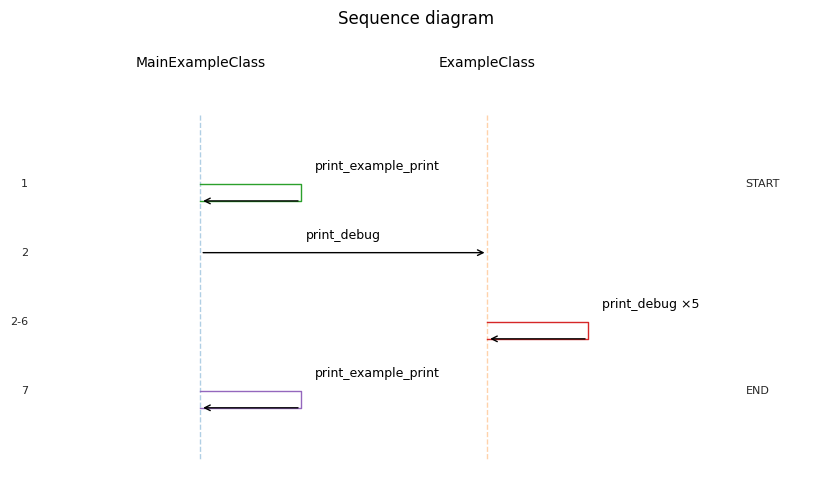

```python
from shouterlog import Shouter
import logging
```

### 1. Initialize Shouter Class

Shouter is the core logging class in shouterlog—a drop-in logger wrapper with richer formatting, traceback-aware records, and optional persistence/plotting hooks. Initialization lets you configure things like supported classes for readable tracebacks, formatting length/styles, whether to show function or traceback info, and paths for saving log records or environment snapshots.

Common settings include `supported_classes`, `dotline_length`, `show_function`, `show_traceback`, `tears_persist_path`, and `persist_env`, but you can keep defaults and customize only what you need.


### 1.1 Shouter options (reference)

This table lists the main Shouter configuration fields and what they control. Fields managed by `attrsx` or handler setup are marked accordingly.

| Option | What it controls | Notes |
| --- | --- | --- |
| `supported_classes` | Tuple of classes Shouter should recognize when building readable tracebacks. | Include classes you want shown in the call chain; if empty, it falls back to the immediate caller. |
| `available_actions` | List of `LogAction` items callable from logger methods via `actions=[...]`. | `add_actions()` can append custom actions or built-ins like Langfuse. |
| `dotline_length` | Width for line/header styles (`line`, `dline`, `pline`, headers). | Controls the visual length of separators and headers. |
| `auto_output_type_selection` | Whether output type is chosen automatically based on traceback depth. | If `True` and `output_type` is `None`, Shouter picks a style. |
| `show_function` | Prefixes output with the current function/class name. | Useful to keep basic context in each line. |
| `show_traceback` | Prefixes output with the traceback chain (leaf -> root). | When `False`, tracebacks are still recorded in tears. |
| `show_idx` | Whether to show the internal log index in output. | Index is always stored in each tear. |
| `tears_persist_path` | File path for persisted JSON log records. | Appended to on error/fatal/critical or `persist_state()`. |
| `env_persist_path` | File path for persisted environment snapshot. | Written with `dill` when `persist_env=True`. |
| `datetime_format` | Timestamp format stored in each tear. | Default is `%Y-%m-%d %H:%M:%S`. |
| `persist_env` | Enables writing a serializable locals snapshot on error/fatal/critical. | Use for post-mortem debugging. |
| `log_records` | In-memory list of all tears captured so far. | Internal; populated automatically. |
| `lock` | Thread lock used during persistence. | Internal; created in `__attrs_post_init__`. |
| `last_traceback` | Storage for last traceback (legacy/local). | Internal; ContextVars hold the active chain. |
| `logger` | The underlying `logging.Logger` instance. | Provided by `attrsx` logger chaining; can be injected. |
| `loggerLvl` | Logger level used by attrsx logger setup. | `attrsx`-managed; can be overridden via attrsx config. |
| `logger_name` | Logger name used by attrsx logger setup. | `None` defaults to module/class naming. |
| `logger_format` | Log format string for the underlying logger. | Defaults to `%(levelname)s:%(name)s:%(message)s`. |
| `log_plotter_h` | LogPlotter instance used for plotting. | Initialized lazily by `show_sequence_diagram()`. |
| `log_plotter_class` | Class used to build the plotter handler. | `attrsx` handler spec. |
| `log_plotter_params` | Parameters passed when constructing the plotter handler. | `attrsx` handler spec. |
| `langfuse_h` | Langfuse handler instance for trace exporting. | Only present if Langfuse is initialized. |
| `langfuse_class` | Class used to build the Langfuse handler. | `attrsx` handler spec. |
| `langfuse_params` | Parameters passed when constructing Langfuse handler. | `attrsx` handler spec. |


```python
shouter = Shouter(
    # optional/ required
    supported_classes = (),
    # optionally 
    ## Formatting settings
    dotline_length = 50,
    auto_output_type_selection = True,
    show_function = False,
    show_traceback = False,
    # For saving records
    tears_persist_path = 'log_records.json',
    datetime_format = "%Y-%m-%d %H:%M:%S",
    # For saving env
    persist_env = False,
    env_persist_path = 'environment.dill',
    ## Logger settings
    logger = None,
    logger_name = 'Shouter',
    loggerLvl = logging.DEBUG,
    logger_format = '(%(asctime)s) : %(name)s : [%(levelname)s] : %(message)s'
)

```

### 2. Basic usage like logging

In basic usage, Shouter behaves like a standard Python logger, so calling `.info`, `.debug`, etc. produces familiar log output out of the box. You can then layer on extras (labels, output types, tracebacks) as needed.


```python
shouter.debug(
    # optional
    dotline_length=30)
shouter.debug("This is a debug message!")
shouter.info("This is an info message!")
shouter.warning("This is a warning message!")
shouter.error("This is an error message!")
shouter.fatal("This is a fatal message!")
shouter.critical("This is a critical message!")
```

    (2026-01-28 00:38:47,911) : Shouter : [DEBUG] : ==============================
    (2026-01-28 00:38:47,914) : Shouter : [DEBUG] : This is a debug message!
    (2026-01-28 00:38:47,915) : Shouter : [INFO] : This is an info message!
    (2026-01-28 00:38:47,918) : Shouter : [WARNING] : This is a warning message!
    (2026-01-28 00:38:47,919) : Shouter : [ERROR] : This is an error message!
    (2026-01-28 00:38:47,921) : Shouter : [CRITICAL] : This is a fatal message!
    (2026-01-28 00:38:47,923) : Shouter : [CRITICAL] : This is a critical message!


### 3. Using different output types

Shouterlog supports multiple output types (lines, headers, titles, and warning styles) that change how the message is formatted. You can either set `output_type` explicitly for manual formatting, or leave it `None` and enable `auto_output_type_selection` so Shouter chooses a style based on the current traceback depth.

Manual examples include `output_type='HEAD1'`, `output_type='line'`, or `output_type='subtitle2'`. Automatic formatting is useful when you want nested calls to visually indent/scale without specifying a format on every log.


```python
# Different types of outputs
shouter.info(output_type="dline")
shouter.info(output_type="HEAD1", mess="Header Message")
```

    (2026-01-28 00:38:47,929) : Shouter : [INFO] : ==================================================
    (2026-01-28 00:38:47,931) : Shouter : [INFO] : 
    ==================================================
    -----------------Header Message----------------- 
    ==================================================


### 4. Custom logger configuration

Shouterlog is built with `attrsx`, so—like other attrsx-based classes—you can replace the built-in logger setup with any already-initialized `logging.Logger` instance. This lets you plug Shouter into existing logging configurations without changing your logger wiring.


```python
import logging

# Custom logger
custom_logger = logging.getLogger("CustomLogger")
custom_logger.setLevel(logging.INFO)

# Shouter with custom logger
shouter_with_custom_logger = Shouter(supported_classes=(), logger=custom_logger)
shouter_with_custom_logger.info(mess="Message with custom logger")
```

### 5. Backwards compatibility with existing loggers

Backwards compatibility means Shouter keeps the standard logger method signatures (`.info`, `.debug`, etc.) while allowing extra keyword args for its custom features. When used inside `attrsx`, any extra parameters that the standard logger does not accept are treated as non-breaking and ignored, so integration does not change existing behavior.

In practice, features like `save_vars`, `label`, or custom `output_type` only take effect when Shouter is active; otherwise they are safely dropped rather than raising errors.


```python
import logging
import attrsx

@attrsx.define
class ExampleClass:

            
    def print_debug(self):

        a = 0

        self.logger.debug("This is a debug message!", save_vars = ["a"])
        
    def print_info(self):
        
        self.logger.info("This is a info message!")
        
    def print_warning(self):
        
        self.logger.warning("This is a warning message!")
        
    def print_error(self):
        
        self.logger.error("This is a error message!", label = "TEST")
        
    def print_critical(self):
        
        self.logger.critical("This is a critical message!")
        
    def perform_action_chain_1(self):
        
        self.logger.debug("Action 1")
        self.print_debug()
                
        self.logger.debug("Action 2")
        self.print_error()
        
    def perform_action_chain_2(self):
                
        a = 1
        b = 'b'
        c = ['list']
        d = {'key' : 'value'}
        e = Shouter()
        
        self.logger.info("Logging vars", save_vars = ["a","b","e"])
        self.logger.error("Saving env", label = "TEST")
```


```python
ec = ExampleClass()

ec.print_debug()
ec.print_info()
ec.print_warning()
ec.print_error()
ec.print_critical()
```

    INFO:ExampleClass:This is a info message!
    WARNING:ExampleClass:This is a warning message!
    ERROR:ExampleClass:This is a error message!
    CRITICAL:ExampleClass:This is a critical message!


```python
shouter_for_example_class = Shouter(
    supported_classes = (ExampleClass,),
    tears_persist_path = 'log_records.json'
)

ec = ExampleClass(logger=shouter_for_example_class)

ec.print_debug()
ec.print_info()
ec.print_warning()
ec.print_error()
ec.print_critical()
ec.perform_action_chain_1()
```

    INFO:Shouter:ExampleClass.print_info:This is a info message!
    WARNING:Shouter:ExampleClass.print_warning:This is a warning message!
    ERROR:Shouter:ExampleClass.print_error:This is a error message!
    CRITICAL:Shouter:ExampleClass.print_critical:This is a critical message!
    ERROR:Shouter:ExampleClass.print_error:+ This is a error message!


### 6. Built-in records from Shouter usage

Each log call creates a built-in record (a "tear") that captures structured metadata: timestamp, level, function/traceback, line numbers, label, and optional environment data. These records accumulate in `Shouter.log_records` so you can inspect or export them later.

You can access the full list with `Shouter.return_logged_tears()` or filter by id via `show_logs_by_id()`. The records are also the input for plotting and persistence features.


```python
shouter_for_example_class = Shouter(
    supported_classes = (ExampleClass,),
    tears_persist_path = 'log_records.json'
)

ec = ExampleClass(logger=shouter_for_example_class)

ec.print_debug()
ec.perform_action_chain_1()
```

    ERROR:Shouter:ExampleClass.print_error:+ This is a error message!


```python
import pandas as pd

pd.DataFrame(ec.logger.return_logged_tears())
```


<div>
<style scoped>
    .dataframe tbody tr th:only-of-type {
        vertical-align: middle;
    }

    .dataframe tbody tr th {
        vertical-align: top;
    }

    .dataframe thead th {
        text-align: right;
    }
</style>
<table border="1" class="dataframe">
  <thead>
    <tr style="text-align: right;">
      <th></th>
      <th>idx</th>
      <th>call_id</th>
      <th>datetime</th>
      <th>level</th>
      <th>function</th>
      <th>mess</th>
      <th>line</th>
      <th>lines</th>
      <th>is_proc</th>
      <th>proc_name</th>
      <th>traceback</th>
      <th>label</th>
      <th>env</th>
    </tr>
  </thead>
  <tbody>
    <tr>
      <th>0</th>
      <td>1</td>
      <td>140329803945952</td>
      <td>2026-01-28 00:38:48</td>
      <td>debug</td>
      <td>ExampleClass.print_debug</td>
      <td>This is a debug message!</td>
      <td>12</td>
      <td>[12]</td>
      <td>False</td>
      <td>Task-2</td>
      <td>[ExampleClass.print_debug]</td>
      <td>None</td>
      <td>{'a': 0}</td>
    </tr>
    <tr>
      <th>1</th>
      <td>2</td>
      <td>140329802125440</td>
      <td>2026-01-28 00:38:48</td>
      <td>debug</td>
      <td>ExampleClass.perform_action_chain_1</td>
      <td>Action 1</td>
      <td>32</td>
      <td>[32]</td>
      <td>False</td>
      <td>Task-2</td>
      <td>[ExampleClass.perform_action_chain_1]</td>
      <td>None</td>
      <td>{}</td>
    </tr>
    <tr>
      <th>2</th>
      <td>3</td>
      <td>140329803946384</td>
      <td>2026-01-28 00:38:48</td>
      <td>debug</td>
      <td>ExampleClass.print_debug</td>
      <td>This is a debug message!</td>
      <td>12</td>
      <td>[12, 33]</td>
      <td>False</td>
      <td>Task-2</td>
      <td>[ExampleClass.print_debug, ExampleClass.perfor...</td>
      <td>None</td>
      <td>{'a': 0}</td>
    </tr>
    <tr>
      <th>3</th>
      <td>4</td>
      <td>140329802125440</td>
      <td>2026-01-28 00:38:48</td>
      <td>debug</td>
      <td>ExampleClass.perform_action_chain_1</td>
      <td>Action 2</td>
      <td>35</td>
      <td>[35]</td>
      <td>False</td>
      <td>Task-2</td>
      <td>[ExampleClass.perform_action_chain_1]</td>
      <td>None</td>
      <td>{}</td>
    </tr>
    <tr>
      <th>4</th>
      <td>5</td>
      <td>104240188118496</td>
      <td>2026-01-28 00:38:48</td>
      <td>error</td>
      <td>ExampleClass.print_error</td>
      <td>This is a error message!</td>
      <td>24</td>
      <td>[24, 36]</td>
      <td>False</td>
      <td>Task-2</td>
      <td>[ExampleClass.print_error, ExampleClass.perfor...</td>
      <td>TEST</td>
      <td>{}</td>
    </tr>
  </tbody>
</table>
</div>


### 7. Debugging errors with Shouter

Debugging support has two persistence paths: (1) on `error`/`fatal`/`critical`, Shouter persists the log records and can dump a serializable snapshot of locals so you can inspect state even if the program breaks afterward; and (2) at any log level, `save_vars` lets you attach selected serializable locals directly to each log record (the "tear"), so they travel with the in-memory log list.

Use `save_vars=["name", "obj.attr"]` on any log call to store specific variables in the tear. For crash-time persistence, set `persist_env=True` (or call `persist_state()` manually) so the environment snapshot is dumped alongside the JSON log records.


```python
shouter_for_example_class = Shouter(
    supported_classes = (ExampleClass,),
    tears_persist_path = 'log_records.json',
    persist_env = True,
    env_persist_path = 'environment.dill'
)

ec = ExampleClass(logger=shouter_for_example_class)

ec.print_debug()
ec.perform_action_chain_2()
```

    INFO:Shouter:ExampleClass.perform_action_chain_2:Logging vars
    ERROR:Shouter:ExampleClass.perform_action_chain_2:Saving env


```python
ec.logger.return_last_words(
    # optional
    env_persist_path = 'environment.dill'
)
```


    {'a': 1,
     'b': 'b',
     'c': ['list'],
     'd': {'key': 'value'},
     'e': Shouter(supported_classes=(), available_actions=[], dotline_length=50, auto_output_type_selection=True, show_function=True, show_traceback=False, show_idx=False, tears_persist_path='log_records.json', env_persist_path='environment.dill', datetime_format='%Y-%m-%d %H:%M:%S', log_records=[], persist_env=False, lock=<unlocked _thread.lock object at 0x7fa0dcf56600>, last_traceback=[], log_plotter_h=None, log_plotter_class=<class 'shouterlog.shouterlog.LogPlotter'>, log_plotter_params={}, langfuse_h=None, langfuse_class=<class 'shouterlog.shouterlog.LangfuseHandler'>, langfuse_params={}, loggerLvl=20, logger_name=None, logger_format='%(levelname)s:%(name)s:%(message)s')}


### 8. Plotting execution flow and reviewing steps

The plotting feature turns recorded tracebacks into a sequence diagram, showing how execution moves between classes/functions over time. It uses `LogPlotter` to render lanes for each class and arrows for calls/events, making it easy to visualize flow from the collected log records.

To use it, call `Shouter.show_sequence_diagram()` (or instantiate `LogPlotter` directly) with a list of log records such as `Shouter.return_logged_tears()`. You can customize labels, sizing, and proc grouping via the plotter parameters when calling the method.


```python
import attrsx

@attrsx.define(handler_specs={
    "example1" : ExampleClass
},
    logger_chaining={
    'logger' : True
})
class MainExampleClass:

    def __attrs_post_init__(self):

        self._initialize_example1_h()

    def print_example_print(self):

        self.logger.debug("Printing from example!", label = "START")

        for i in range(5):

            self.example1_h.print_debug()

        self.logger.debug("Printing from example!", label = "END")

```


```python
shouter_for_main_example_class = Shouter(
    supported_classes = (MainExampleClass, ExampleClass,),
    tears_persist_path = 'log_records2.json',
    loggerLvl=logging.DEBUG
)

mec = MainExampleClass(logger=shouter_for_main_example_class)

mec.print_example_print()
```

    DEBUG:Shouter:MainExampleClass.print_example_print:Printing from example!
    DEBUG:Shouter:ExampleClass.print_debug:+ This is a debug message!
    DEBUG:Shouter:ExampleClass.print_debug:+ This is a debug message!
    DEBUG:Shouter:ExampleClass.print_debug:+ This is a debug message!
    DEBUG:Shouter:ExampleClass.print_debug:+ This is a debug message!
    DEBUG:Shouter:ExampleClass.print_debug:+ This is a debug message!
    DEBUG:Shouter:MainExampleClass.print_example_print:Printing from example!


```python
mec.logger.show_sequence_diagram()
```


    

    


```python
mec.logger.show_logs_by_id(ids = [1,2])
```


    [{'idx': 1,
      'call_id': 140328889495328,
      'datetime': '2026-01-28 00:38:48',
      'level': 'debug',
      'function': 'MainExampleClass.print_example_print',
      'mess': 'Printing from example!',
      'line': 17,
      'lines': [17],
      'is_proc': False,
      'proc_name': 'Task-2',
      'traceback': ['MainExampleClass.print_example_print'],
      'label': 'START',
      'env': {}},
     {'idx': 2,
      'call_id': 104240187936336,
      'datetime': '2026-01-28 00:38:48',
      'level': 'debug',
      'function': 'ExampleClass.print_debug',
      'mess': 'This is a debug message!',
      'line': 12,
      'lines': [12, 21],
      'is_proc': False,
      'proc_name': 'Task-2',
      'traceback': ['ExampleClass.print_debug',
       'MainExampleClass.print_example_print'],
      'label': None,
      'env': {'a': 0}}]


### 9. Using actions from logger

Actions are post-log hooks that run after a log call. Each action is a named function with optional input validation and preprocessing that can merge the log record ("tear") with your parameters. This lets a log statement trigger side effects like emitting Langfuse traces, flushing buffers, or invoking custom handlers without changing your main logging flow.

To add a new action, create a `LogAction` with a unique name, a callable, and optional `input_model`/`input_prep_func`, then pass it to `Shouter.add_actions([...])`. Default actions (like the Langfuse handler) are only registered if the handler has been initialized; once it is, calling `.add_actions()` will append those built-ins to `available_actions`, making them callable from logger methods.


```python
import attrsx

@attrsx.define
class ExampleClass2:

            
    def print_debug(self):

        a = 0

        self.logger.debug("This is a debug message!", save_vars = ["a"], actions = [{
            "name" : "langfuse.log_trace",
            "params" : {
                "input" : {"a" : a}
            }
        }])

@attrsx.define(handler_specs={
    "example1" : ExampleClass2
},
    logger_chaining={
    'logger' : True
})
class MainExampleClass2:

    def __attrs_post_init__(self):

        self._initialize_example1_h()

    def print_example_print(self):

        self.logger.debug("Printing from example!", label = "START", actions = [{
            "name" : "langfuse.log_trace"
        }])

        for i in range(5):

            self.example1_h.print_debug()

        self.logger.debug("Printing from example!", label = "END", actions = [{
            "name" : "langfuse.log_trace"
        }])

```


```python
from dotenv import load_dotenv
load_dotenv("../../.langfuse.env")

shouter_with_langfuse = Shouter(
    supported_classes = (MainExampleClass2, ExampleClass2,),
    tears_persist_path = 'log_records2.json',
    loggerLvl=logging.DEBUG
)

shouter_with_langfuse._initialize_langfuse_h(uparams = {
    "params" : {
        "host" : "http://localhost:3000"
    },
    "env_mapping" : {
        "secret_key" : "SECRET_KEY",
        "public_key" : "PUBLIC_KEY",
    }
})

shouter_with_langfuse.add_actions()

mec2 = MainExampleClass2(logger=shouter_with_langfuse)

mec2.print_example_print()
```

    DEBUG:Shouter:MainExampleClass2.print_example_print:Printing from example!
    DEBUG:Shouter:ExampleClass2.print_debug:+ This is a debug message!
    DEBUG:Shouter:ExampleClass2.print_debug:+ This is a debug message!
    DEBUG:Shouter:ExampleClass2.print_debug:+ This is a debug message!
    DEBUG:Shouter:ExampleClass2.print_debug:+ This is a debug message!
    DEBUG:Shouter:ExampleClass2.print_debug:+ This is a debug message!
    DEBUG:Shouter:MainExampleClass2.print_example_print:Printing from example!

